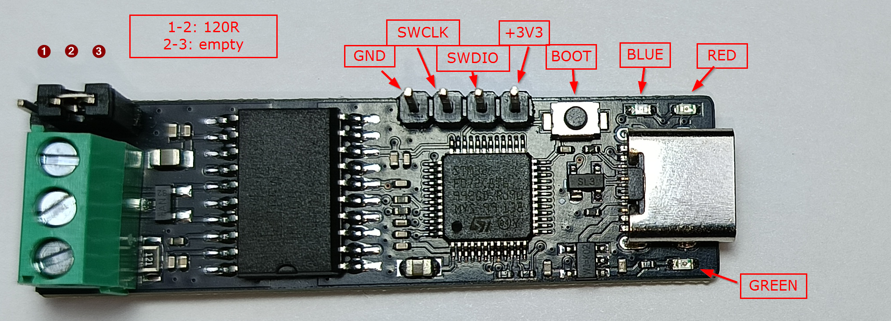
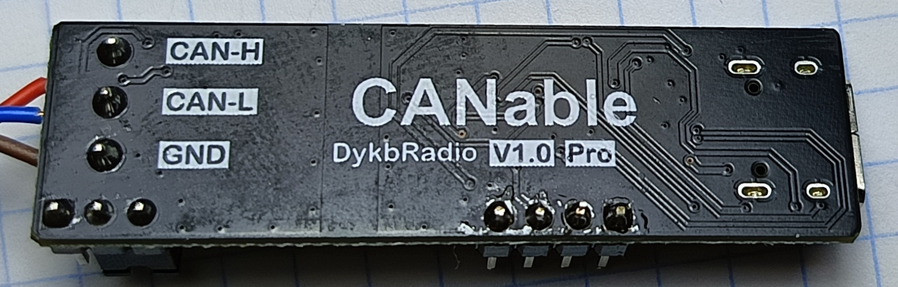

# USB to CAN adapter, Lawicel/SLCAN based

Прошивка USB-CAN адаптера на базе STM32F072C8. Устройство подключается к компьютеру по USB, определяется как виртуальный COM-порт USB CDC и обменивается CAN-кадрами через текстовый протокол Lawicel/SLCAN.

Проект является форком [canable-fw](https://github.com/normaldotcom/canable-fw), который основан на прошивке CANtact. Текущая версия адаптирована для платы CANable DykbRadio v1.0 Pro на базе STM32F072C8.




## Назначение

Прошивка предназначена для внутреннего использования в качестве простого USB-CAN интерфейса. С компьютера можно:

- настроить скорость CAN-шины;
- открыть или закрыть CAN-канал;
- отправлять standard и extended CAN-кадры;
- отправлять data и remote frames;
- принимать CAN-кадры из шины в формате SLCAN.

## Принцип работы

После подключения к USB устройство запускает USB CDC интерфейс. Управляющая программа на компьютере отправляет в COM-порт строки SLCAN, завершённые символом `\r`. Прошивка принимает эти строки, разбирает команды и передаёт CAN-кадры в аппаратный контроллер bxCAN.

Перед передачей CAN-кадров нужно настроить параметры шины. Обычно последовательность такая:

1. Выбрать скорость командой `S0`...`S8`.
2. При необходимости выбрать режим `M0` или `M1`.
3. При необходимости настроить автоматическую повторную передачу `A0` или `A1`.
4. Открыть канал командой `O`.
5. Передавать CAN-кадры командами `t`, `T`, `r`, `R`.
6. Закрыть канал командой `C`.

Пока канал открыт, входящие SLCAN-команды помещаются во внутреннюю очередь CAN TX и затем отправляются через аппаратные transmit mailboxes bxCAN. При закрытии канала очередь ожидающих отправки CAN-кадров очищается.

Кадры, принятые из CAN-шины, обрабатываются в CAN interrupt context, помещаются в очередь CAN RX, затем в основном цикле преобразуются обратно в SLCAN-строки и отправляются на компьютер через USB CDC.

Для USB RX/TX и CAN RX/TX используются очереди и статические буферы. Это позволяет держать обработчики прерываний короткими и выполнять разбор протокола в основном цикле.

## Ограничения и особенности

- Команды настройки канала нужно отправлять до `O`.
- Передача CAN-кадров разрешена только после успешного открытия канала командой `O`.
- Прошивка не отправляет ACK/NACK на каждую SLCAN-команду.
- Если компьютер отправляет кадры быстрее, чем CAN-шина успевает их передавать, очередь CAN TX может заполниться.
- Переполнение CAN TX особенно вероятно, если на шине нет второго активного узла, который подтверждает кадры ACK, если шина плохо терминирована или если включена автоматическая повторная передача.
- Команды `V` и `E` зарезервированы в коде, но сейчас не являются полноценным пользовательским интерфейсом.

## Светодиоды

На плате расположены три светодиода: зелёный, красный и синий.

- Зелёный светодиод аппаратно показывает наличие питания.
- Синий светится постоянно, пока CAN-канал открыт командой `O`.
- Красный вспыхивает при передаче CAN-кадра.

## Поддерживаемые команды

Команды отправляются в USB CDC COM-порт и должны завершаться `\r`.

| Команда | Описание |
| --- | --- |
| `O` | Открыть CAN-канал |
| `C` | Закрыть CAN-канал |
| `S0` | Установить bitrate 10 kbit/s |
| `S1` | Установить bitrate 20 kbit/s |
| `S2` | Установить bitrate 50 kbit/s |
| `S3` | Установить bitrate 100 kbit/s |
| `S4` | Установить bitrate 125 kbit/s |
| `S5` | Установить bitrate 250 kbit/s |
| `S6` | Установить bitrate 500 kbit/s |
| `S7` | Установить bitrate 750 kbit/s |
| `S8` | Установить bitrate 1 Mbit/s |
| `M0` | Normal mode |
| `M1` | Silent mode |
| `A0` | Отключить automatic retransmission |
| `A1` | Включить automatic retransmission |
| `tIIILDD...` | Передать standard data frame |
| `TIIIIIIIILDD...` | Передать extended data frame |
| `rIIIL` | Передать standard remote frame |
| `RIIIIIIIIL` | Передать extended remote frame |
| `V` | Зарезервировано для версии прошивки |

Обозначения:

- `III` - standard 11-bit CAN ID в hex, 3 символа.
- `IIIIIIII` - extended 29-bit CAN ID в hex, 8 символов.
- `L` - DLC, от `0` до `8`.
- `DD...` - данные кадра, два hex-символа на байт.

Примеры:

```text
S4\r
O\r
t1230\r
t12381122334455667788\r
r1231\r
C\r
```

## Диагностика

В `DEBUG` сборке прошивка ведёт счётчики переполнения внутренних очередей:

- CAN TX queue overflow;
- CAN RX queue overflow;
- USB CDC TX queue overflow;
- USB CDC RX queue overflow.

Статистика периодически выводится через SEGGER RTT. Эти счётчики полезны при нагрузочных тестах, когда нужно понять, какая часть системы не успевает: USB, SLCAN parser или CAN-шина.

Если растёт CAN TX overflow, сначала проверьте:

- есть ли второй активный CAN-узел, подтверждающий кадры ACK;
- установлены ли терминаторы 120 Ом;
- совпадает ли bitrate;
- не включён ли silent mode;
- не отправляет ли host кадры быстрее физической пропускной способности CAN-шины.

## Сборка

Основная сборка проекта выполняется через CMake presets.

Debug:

```sh
cmake --preset Debug
cmake --build --preset Debug
```

Release:

```sh
cmake --preset Release
cmake --build --preset Release
```

После сборки в каталоге `build/<Preset>` создаются файлы:

- `usb-to-can-converter-based-on-lawicel-protocol.elf`;
- `usb-to-can-converter-based-on-lawicel-protocol.hex`;
- `usb-to-can-converter-based-on-lawicel-protocol.bin`.

Для сборки нужен `arm-none-eabi-gcc`. На Windows можно использовать STM32CubeCLT или другой установленный GCC toolchain для ARM Embedded.

## Прошивка

Способ прошивки зависит от используемого оборудования:

- через SWD/ST-Link из отладчика или внешнего flash tool;
- через DFU bootloader, если плата загружена в boot mode и поддерживает DFU.

Перед прошивкой убедитесь, что выбран файл из нужной конфигурации сборки, например `build/Release/*.bin` или `build/Release/*.hex`.

## Отладка

Для отладки можно использовать ST-Link, SWD и SEGGER RTT. В `DEBUG` сборке активен `debug_printf`, который выводит диагностические сообщения и статистику через RTT.

При проблемах с передачей CAN сначала проверяйте физический уровень CAN-шины: питание трансивера, общий GND, терминаторы, bitrate и наличие второго узла для ACK.

## License

See [LICENSE.md](../LICENSE.md).
